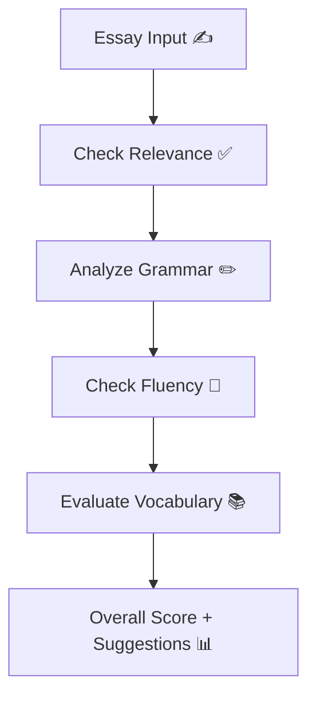

# ✨ SmartEssay Evaluator using Gemini API ✍️📊

Welcome to **SmartEssay Evaluator**, an advanced essay assessment system built using Google's **Gemini 1.5 Flash API**. This tool is capable of grading **all types of essays** — from IELTS, TOEFL, GRE, and SAT to academic, business, or even general writing tasks. 🎓📝

---

## 🚀 Overview

This project leverages:
- 🧠 **Google Gemini API**
- 🔗 **LangChain** for prompt formatting
- 🔀 **LangGraph** for modular evaluation flow
- 🐍 **Python + Google Colab** for fast prototyping

📝 It analyzes and scores essays using:
- ✅ Relevance  
- ✏️ Grammar  
- 🔁 Fluency  
- 📚 Vocabulary

📊 Final output includes:
- A total **score out of 10**
- AI-generated **suggestions for improvement**
- Optionally compare outputs from **multiple LLMs** (e.g., GPT-4, LLaMA)

✅ **Supported Essay Types**:
- Academic & Research Essays  
- IELTS, TOEFL, GRE, SAT writing tasks  
- General Purpose Essays  
- Formal/Business Writing  
- College Assignments

---

## 📦 Features

- ✅ LLM-driven essay scoring (relevance, grammar, fluency, vocabulary)
- ✍️ AI-powered feedback and specific improvement suggestions
- 🧮 Final score calculation (out of 10)
- 🔍 Detects weak essays and gives examples to improve
- 🧪 Easily test different essay versions (good vs poor)
- ⚙️ Modular code design using LangGraph

---

## 🧰 Installation Guide

### 1. Clone the Repository
```bash
git clone https://github.com/your-username/smartessay-evaluator.git
cd smartessay-evaluator
```

### 2. Install Dependencies
```bash
pip install langgraph langchain-google-genai
```

### 3. Configure Gemini API Key
```python
import google.generativeai as genai
genai.configure(api_key="YOUR_GEMINI_API_KEY")
```

---

## 🖥️ Tech Stack

| Tool              | Role                             |
|------------------|----------------------------------|
| 🧠 Gemini API     | Main language model              |
| 🔗 LangChain      | Prompt & LLM input-output        |
| 🔀 LangGraph      | Custom scoring workflow engine   |
| 🐍 Python         | Core programming logic           |
| 📓 Google Colab   | Development interface            |
| 🎯 Regex & Typing | Score parsing & validation       |

---

## 🧪 Sample Output

```text
Relevance Score: 0.9 / 1  
Grammar Score: 1.8 / 2  
Fluency Score: 2.8 / 3  
Vocabulary Score: 3.5 / 4  
------------------------------
Final Essay Score: 9.0 / 10
```

✨ **Suggested Improvements**:
- Use more varied sentence structures  
- Enhance paragraph transitions  
- Add a stronger concluding statement AND Improved essay

---

## ⚙️ How It Works



---

## 💡 Use Cases

- 🏫 IELTS/TOEFL/GRE/SAT test prep tools  
- 🎓 Academic essay feedback assistant  
- 🧑‍🏫 Instructor aid for scoring student essays  
- 📝 Personal writing skill enhancement  
- 🤖 NLP and AI research in education tech  

---

## 🙌 Acknowledgements

Thanks to:
- 🤖 [Google Gemini API](https://aistudio.google.com/app/apikey)  
- 🔗 LangChain and LangGraph teams  
- 🧪 AI researchers and educators contributing insights  


🎯 **Evaluate essays like a pro — instantly, intelligently, and across all formats!**
